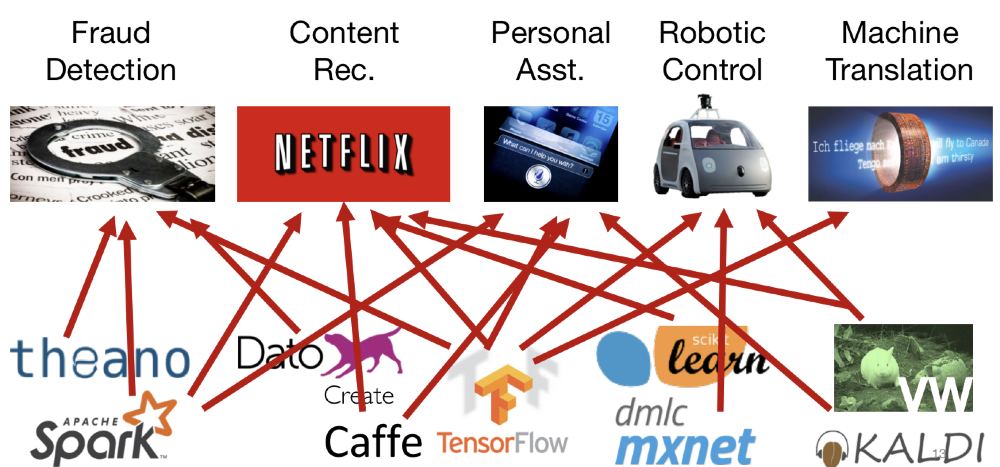
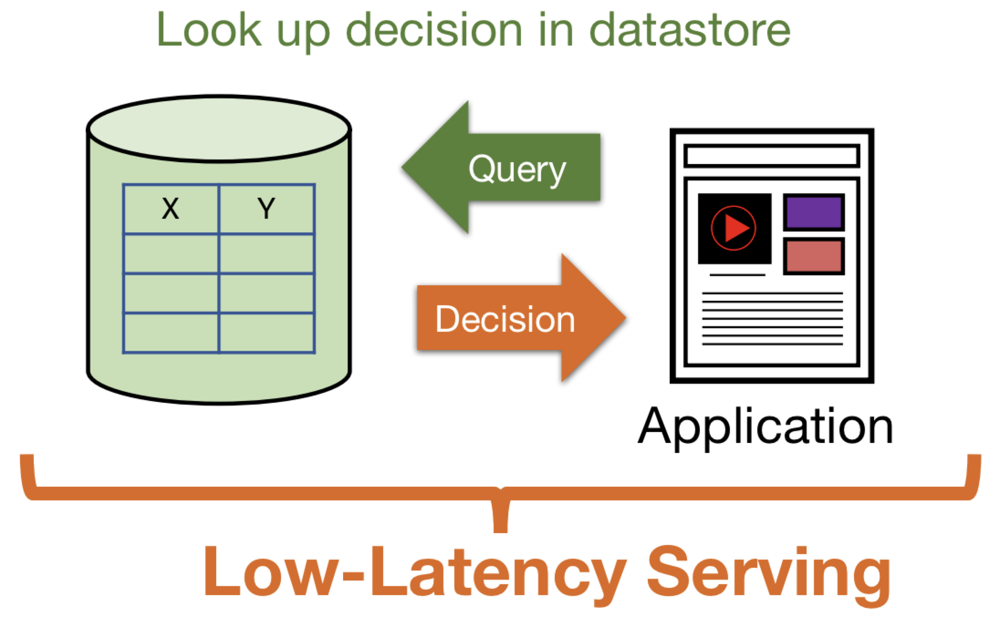
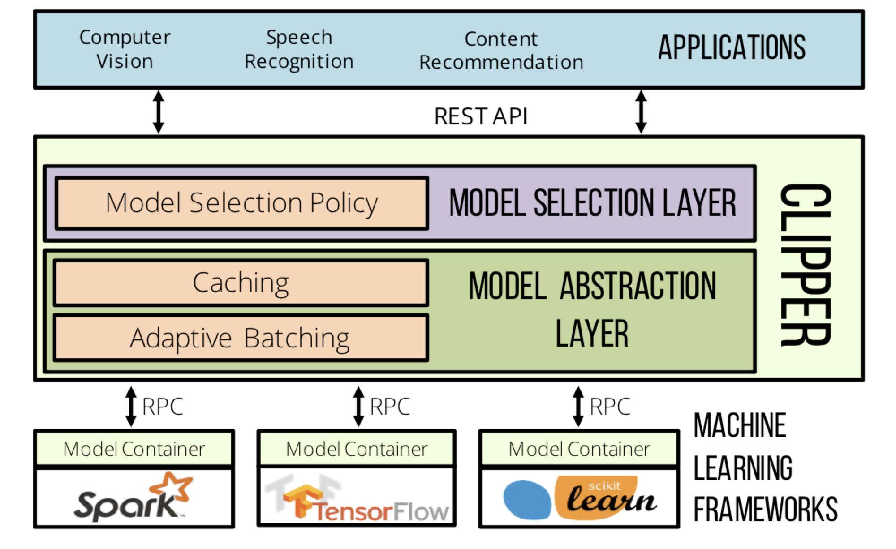
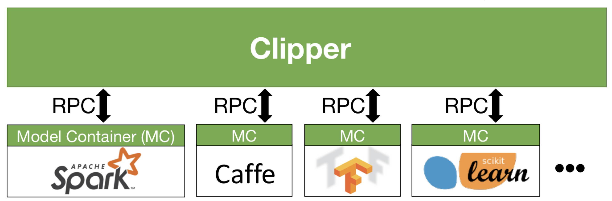
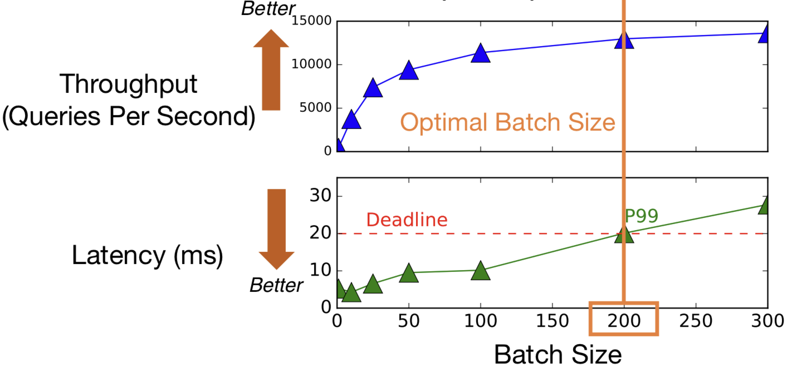
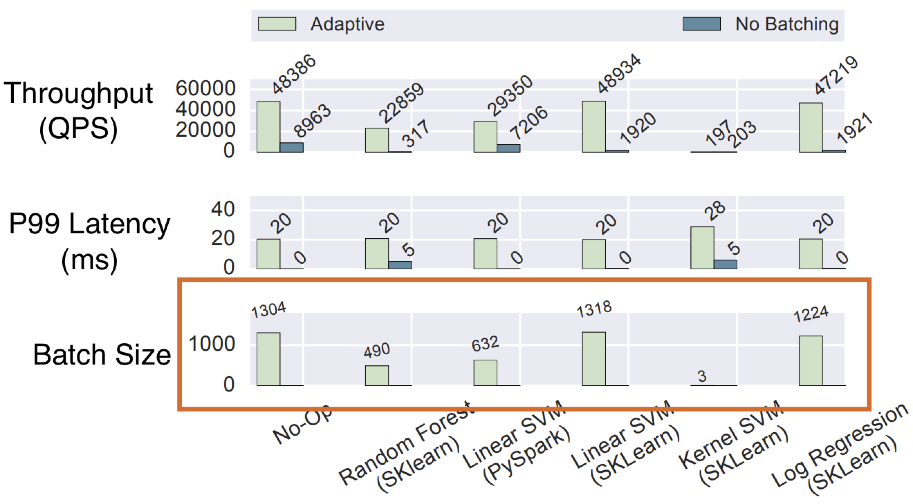
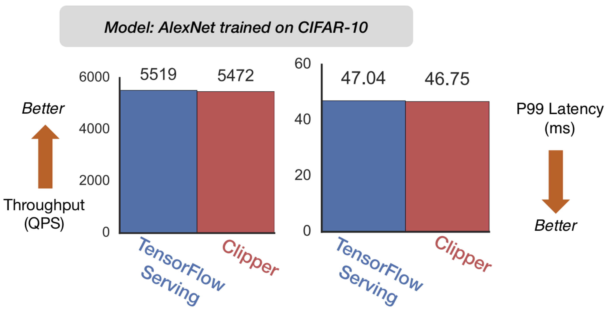

# Paper Reading - Clipper: A Low-Latency Online Prediction Serving System - NSDI 2017

## Background

对于机器学习应用，依赖两个阶段：训练和推理。训练是利用数据建立模型的阶段；推理是使用训练好的模型对给定输入进行预测的阶段。

训练和推理的差别体现在，训练通常很耗费计算资源，可能需要多次传送大数据集；但推理过程通常不怎么耗费资源。训练过程需要几个小时甚至几天都是很正常的，相反地，推理过程通常是面向用户应用程序，必须要实时完成，且数据数量级比训练集要大。

这篇文章主要关注的就是这种预测服务，比如说提供一个只有几十毫秒延迟的预测查询服务。

部署这种服务的难度是不同于那些训练阶段的框架的。这其中主要涉及两点，一是提供低延迟高吞吐量的服务工作负载，二是庞大且不断增常的机器学习模型和框架的生态。

第一个问题，机器学习的模型变得越来越复杂，一个比较 fancy 的图像模型可能涉及几十亿次浮点运算，只为了得到一个预测结果。这种模型太复杂了，导致大家会去使用一些专用的硬件来支持这种模型，这种硬件既可以用来做训练也可以预测。

因为这些专属的硬件，服务基本依赖于这些硬件，所以这意味着这些服务往往被部署到关键路径上。关键路径意味着我希望这些服务即使在高负载下依旧能搞保持服务质量。

以 Google 这篇16年的论文 [Google’s Neural Machine Translation System: Bridging the Gap between Human and Machine Translation](https://arxiv.org/pdf/1609.08144.pdf) 为例，谷歌翻译每天就要翻译 140 百亿的单词，换算过来就是 82000 个 GPU 007 工作制。实际上，因为这个代价太大了，谷歌直接发明了一个新的硬件 TPU 来服务这种工作负载。

类似于谷歌翻译这种服务其实很具有代表性，它代表了很多大厂的对与 Prediction Server 的解决策略，搭建一个专有系统。他们有一个很厉害但是代价很高的模型，他们有一个对应的应用，于是他们搭建一个 ad hoc 的系统。

这样的解决办法带来的问题是什么呢，首先需要高昂的代价去构建和维护这样一个系统，而且需要 ML 和 系统专家；而且这种紧耦合的模型和应用程序意味着你修改和更新模型都很麻烦，但是 data science 往往是迭代的，两者目标不一致；最后，这种方法只支持唯一的系统。

最后这个问题是比较重要的，因为机器学习的模型和生态蓬勃发展。我们为什么需要多个模型和框架，主要原因在于不同的框架和模型对于不同的任务有不同的效果。比如说 TF 的某个模型很适合机器翻译，但是在查错上的表现就一般。所以对于同一个应用，我们可能会使用不同框架的不同模型，来对于不同的问题进行机器学习的训练，从而获得更高的准确率。很快，就会陷入混乱，各种应用和框架的依赖相互混杂在一起。

这同样是一个问题，机器学习框架只负责产出模型而不关心服务环境，如果是很负责的环境，部署和管理都很复杂，这也是为什么大公司花费很长时间去构建专用的一条龙；第二种，框架对硬件资源要求很高，所以他们会部署在关键路径上以满足性能需求，而复杂的环境会导致满足这个需求变得困难。

普通公司根本负担不起这么大的成本去专门搞一套专有的服务系统，但是如果真的需要一个非常低延迟的服务，该怎么办呢？

很多公司使用一些离线的方法，提前把结果算好存储在数据库中，然后服务直接查数据库。

这种方法的问题也很明显，首先它需要准备好所有的相关查询，这意味着你的应用程序的输入域会被限制；你还会浪费很多的计算和存储空间；最重要的，如果你要更新你的预测结果，你必须重跑一遍你的批处理作业。

Clipper 拒绝这种妥协，它同时解决了我们刚刚提出的两个挑战，提供了低延迟高吞吐量的服务工作负载，并且服务于庞大且不断增常的机器学习模型和框架的生态。

## Clipper

Clipper 的解决方案是：

* 简化了部署，提出了一种分层架构，把 serving system 中各种问题都分离开来了；
* 因此，它能够跨多个 ML 框架服务多个模型；
* 最后，用了各种系统层面上的东西，caching，batching 和 scale-out 来提供高性能服务。
* 

### Model Abstraction Layer

Clipper 内部分成两层，一层是 Model Abstraction Layer，给模型提供了一个通用接口，还负责了延迟和最大吞吐量；一层是 Model Selection Layer，负责从多个模型结果中选择一个具体返回的模型结果。

在 Clipper 的架构中，每个 container 都有一个模型，里面有所有需要的对应依赖，通过抽象出一个中间层的通用 API，用户就可以自主的用 API 去启一个模型。

这种方法通过这种更高一级的抽象 API 去创建一个容器级模型简化了部署，并且：

* 由于本身模型代码不需要做任何修改，评估模型好坏仍然可以使用对应机器学习框架本身的代码；
* 容器部署保证了资源隔离，扩容也很方便，实现了水平扩展。

使用水平扩展固然提高了吞吐量，但是并没有解决延迟的问题，更具体的说，所有这个机器学习的框架都专注于优化批处理而没有管延迟。而对于我们的系统而言，除了高吞吐量，我们还希望能保证服务质量，也就是低延迟。

为什么对于 ML 框架来说，批处理这么重要呢？首先，一个页面加载可能会生成很多查询，把它们放在同一个 batch 来评估是有意义的；第二，所有这些框架都会利用硬件的并行计算，batch 可以更好的进行并行计算；最后，batch 可以减少系统本身发送数据消耗。

所以问题就变成如何获得一个合适的 batch size，这涉及到硬件本身的配置，哪些 model 跑在这上面的；model 和框架，不同的模型和框架它的最优 batch size 完全不一样；当然还有系统本身的负载。

Clipper 提出了一个简单有效的方法既保证了吞吐量，又保证了低延迟。它称之为自适应 batching：

* Clipper 会递增 batch size 直到服务返回的延迟超出设定的延迟，这个延迟大小是由用户提供的（加法增）；
* 一旦延迟超过设定值，batch size 的大小就会减少 10%，并认为这是最后的对应模型的 batch size（乘法减）。

这个方法非常的简单且高效，比如下面这个四层神经网络的例子。通过上述两种方法拿到了最优 batch size：

Clipper 同样实验了不同的框架和模型，图中为结果。

为了验证 Clipper 的效率，它和谷歌的 TensorFLow Serving 进行了比较。在使用相同模型的前提下，Clipper 略微逊于 TF Serving，但是前者跨多个 ML 平台。

### Model Selection Layer

最后我们简单说一下 Model Selection Layer，不管是同一个模型的多个版本，或者是针对同一个预测结果的不同模型，我都喜欢能够评测一下新模型的结果和旧的相比如何，因此，需要可以有一个模型的多个选择。Clipper 使用了置信区间的思想来确定最后到底选择哪一个模型作为输出结果。具体的，它使用了多臂老虎机的算法进行了模型选择的优化，更多的感兴趣可以见论文，此处不再介绍。

## Summary

总结一下，

- **Prediction-serving** is an important and **challenging** area for systems research

- - Support low-latency, high-throughput serving workloads
  - Serve large and growing ecosystem of ML frameworks

- **Clipper** is a first **step** towards addressing these challenges

- - Simplifies deployment through layered architecture
  - Serves many models across ML frameworks concurrently
  - Employs caching, adaptive batching, container scale-out to meet interactive serving workload demands

讲一讲这篇文章的亮点和思考，首先一般来说我们谈到 ML 框架我们想到的都是怎么优化这个训练流程，确实很少去考虑模型的放置，这篇文章告诉我们，模型放置也很重要。

Clipper 它干的第一件有意义的事情是它把所有那些混沌复杂的东西简单化了，它用一个中间件去解耦，它抽象了一个统一的模型放置 API，简化了整个部署流程，道出了软件工程的本质是抽象。

CLipper 的另一个亮点是自适应 Batching，但是这个事情它的解决策略非常的简单粗暴，但是它的效果很好，所以有一个完整的系统，方法不需要多复杂，有一个好的实验优化结果，照样上顶会。

但是 Clipper 实际上并不涉及硬件资源的配置，可以预想到的是，不论是什么模型肯定都优先希望自己的模型获得最好的硬件资源嘛，在 Clipper 中这部分内容还是需要用户的主动配置，这也完全可以理解，可以预想到的是，如果模型被放置在配置比较差的机器上，那么它的吞吐量和延迟肯定比较高。不过既然我们可以 AIMD 的方法去做自适应 batching，这同样也可以启发我们用类似的方法自动的去调度一些模型的放置，比如说在运行过程中发现哪些模型是常被选上的，那些模型正确率很高，可以让系统自动的去重新放置这个模型，计算吞吐量和延迟的变化，从而得到一个更高效的放置系统。