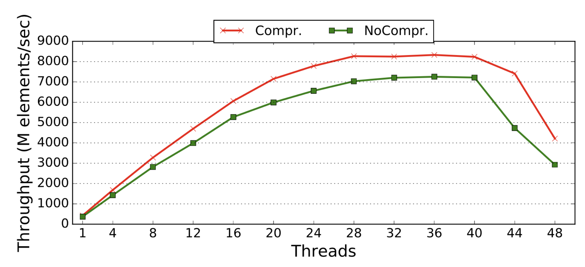
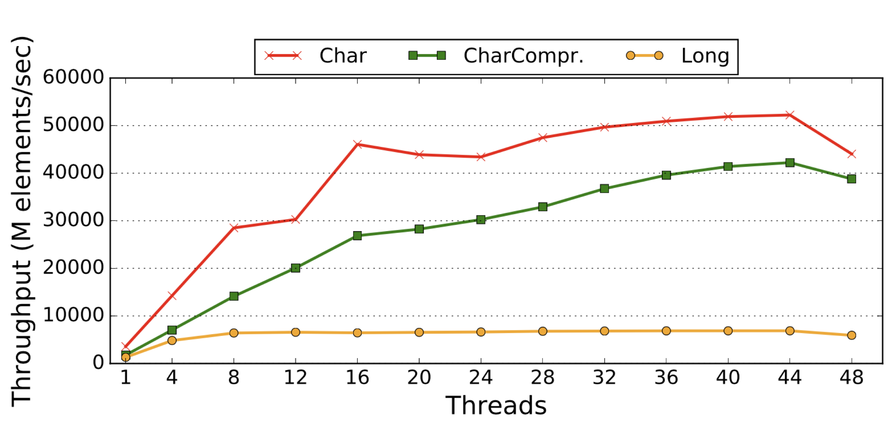
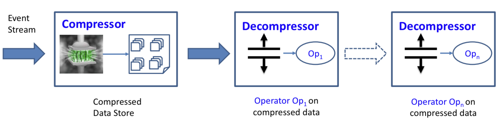
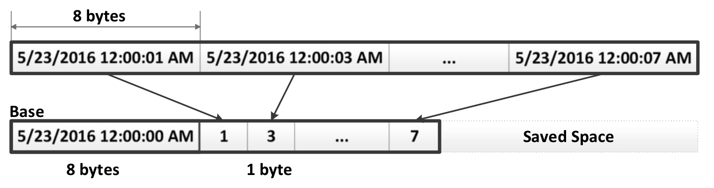
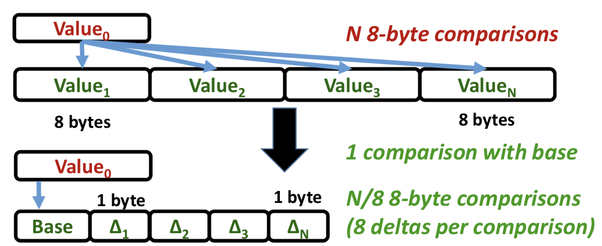
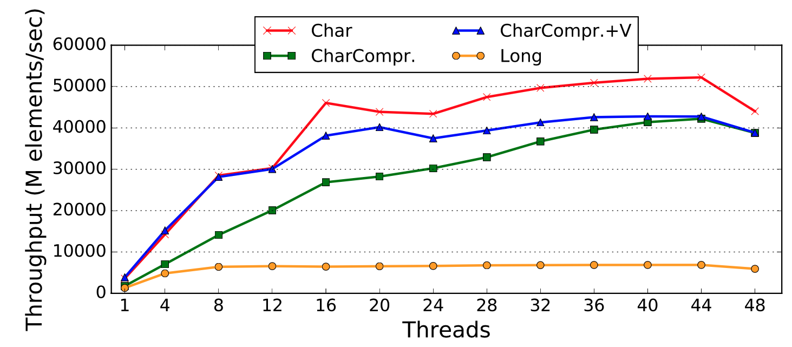
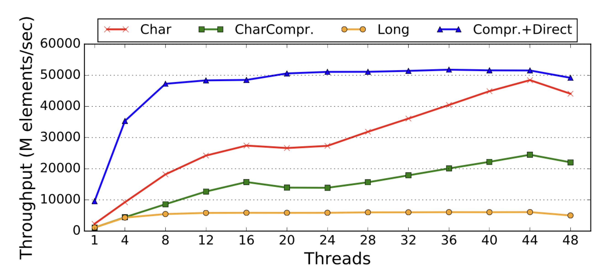

# TerseCades: Efficient Data Compression in Stream Processing

## Is Compression Useful for Streaming?

为了满足流处理近乎实时的要求，流处理引擎通常要求流数据（大量传入）驻留在要处理的主内存中，从而给服务器主内存系统的容量和带宽带来巨大压力。 因此，重要的是探索**减轻数据存储压力**的方法，例如数据压缩。

一个很自然的问题是，数据压缩对于流处理而言是否有用，评估其有用性的自然出发点是检查数据流是否可压缩以及压缩产生的数据量减少是否提高了流处理的吞吐量。直觉上来说，如果一个流数据只有些简单的算子，没有任何额外的开销，那么**带宽**应该成为瓶颈：内存带宽或者是网络带宽。

为此，论文使用了来自生产数据中心的网络可达性测量的 Pingmesh 数据流进行了一组分析，然后，使用先进的高性能流库 Trill 和 STREAM 基准套件来评估数据量减少（即压缩）对吞吐量的影响。

**先看使用 Trill 的实验结果**。假设 Trill 使用了 `WHERE` 查询对某一个 8 字节大小的 filed 进行 `WHERE (e => e.errorCode != 0)` 的查询，理想情况下期望观察到**内存带宽**成为主要瓶颈。

对于这样一个简单的 WHERE 查询，它用的就是一个 Filter 运算，论文使用数据字段的两个版本（8 字节和 1字节），1 字节用来模拟理想的无开销压缩，压缩比为 8。下图为查询结果：

和期望的一样，1 字节的压缩始终优于 8 字节的非压缩版本，但是，跟内存流量减少 8 倍相比，吞吐量只大概提高了 10% ～ 15%。这表明即便是执行简单的查询，Trill 中的查询处理的瓶颈也不在内存带宽这。

问题出在哪里？论文使用 Trill 运行并分析了一系列不同的查询，根据分析结果得到，对于类似 Filter 这样的无状态查询，大部分时间都花在了构造流数据结构语义，比如对于每一个传入的数据，Filter 要执行数据 payload 的即使复制并创建对应的 Stream Event，这就涉及到**内存分配**的开销；而要将数据转换为灵活的**面向列的数据批处理**又涉及到内存复制和重新分配，这两个操作占 Query 总时间的三分之二以上。第二个主要开销在于低效的按位操作，剩余三分之一的时间中，有 46% 的时间用于确定应设置的位。而对于 GROUPBY 这样的查询，超过 90% 的时间都用在处理哈希表上，比如 key 的查找。

得出的结论是，诸如 Trill 之类的最新流引擎没有**适当地优化以完全利用可用的内存带宽**，从而限制了通过数据压缩减少内存消耗的好处。在这篇论文的工作中，它通过集成一些简单的优化来解决此问题，这些优化可使流引擎更加高效，从而对内存更加敏感。

**再看 STREAM 基准套件**（即消除了 Trill 上的开销）。下图展示了三种情况下 Add 操作的吞吐量：1）Long – 64 位无符号整数；2）Char – 8位 char 类型（模拟 8 倍压缩且无压缩/解压缩开销）；3） CharCompr，使用 Base-Delta 编码将 64 位值压缩为 8 位：

可以从上图得出两个主要结论。首先，当传输的数据量减少 8 倍（从 Long 到 Char）时，最终的吞吐量也成比例增加。吞吐量的显着提高表明，由于不存在其他人为瓶颈（例如，内存分配/重新分配，低效的按位操作和哈希映射插入/搜索），吞吐量仅受内存带宽限制，压缩会按压缩比例成比例地降低带宽压力。第二，使用压缩机制，例如CharCompr。使用简单的 Base-Delta 编码，与未压缩的基线相比（仍可观察到的吞吐量最大增加 6.1 倍）仍具有很多优势，这使得简单的数据压缩算法成为提高流处理性能的一种有吸引力的方法。同时，很明显，即使简单的压缩算法也会产生明显的开销，从而降低了压缩的好处，因此，选择压缩算法很重要。

## Efficient Compression

论文首先介绍了流引擎所需的关键优化（可以称为**一阶优化**），然后介绍在 TerseCades 中部署的压缩算法以及背后的原因

### Prerequisites for Efficient Data Streaming

在前面的实验中已经表明，为了让流处理引擎更高效，应避免几个主要瓶颈：

首先，在大多数操作系统中，动态内存分配/重新分配的成本很高，并且流处理中的每个 windowing 的永久内存分配会显着降低总体吞吐量。发生这种情况是因为使用任何 window 运算符进行流式传输的标准实现都需要动态分配内存（以存储数据窗口）。解决此问题的一种可能策略是确定每个 window 通常需要多少内存（该数量通常会随着时间的推移而稳定，因为窗口通常是相同大小的），然后使用固定的内存分配策略，比如大多数内存分配发生一次，然后从内部内存池重用。在 TerseCades 中使用性能分析来确定特定大小的窗口通常需要多少内存，在开始时分配所有这些内存，然后仅在执行期间根据需要分配更多的内存。

第二，某些流运算符例如 GroupApply 的实现需要对哈希图数据结构进行频繁的操作。同样，许多常见的整数数据类型（例如字符串）如果完全存储（例如，服务器ID为64字节），则可能需要大量内存，但是可以有效地进行哈希处理以减少空间需求。不幸的是，标准的C ++ STL库没有提供这种效率。为了解决此问题，论文考虑了流数据的细节，使用相应的API 实现了自己的 hashmap 数据结构。

第三，过滤运算符（例如，Where）的有效实现需要有效的位向量操纵。例如，当使用Trill流引擎运行具有单个比较条件（例如 `WHERE ( ErrorCode== 0)`）的简单查询时，大约 46％ 的总执行时间与简单逐位相关操作。不幸的是，这种巨大的开销限制了任何进一步性能优化的好处。在 TerseCades 的设计中，为使用 C ++ 的 FIlter 运算符实现了自己的简单按位表示（以及相应的API），从而大大减少了过滤开销。

总而言之，这些优化能够将系统的性能提高3倍以上，但是可惜的是，论文并没有在这方面披露更多细节。

### Practical Compression for Streaming

进行一阶优化后，会发现此时系统内存带宽成为主要瓶颈，流处理中使用的数据主要部分本质上都是合成的，因此具有大量冗余，可以进行数据压缩并利用。

下图显示了论文提出的流处理管道。

与传统流处理的主要区别在于，外部流事件在存储之前先被压缩（通常以面向列的格式进行压缩，这通常对于具有较高空间局部性的应用程序更为可取）。注意，正常情况下流运算符在访问所有压缩数据之前还需要对它们进行解压缩。Operator 被链接在一起以形成管道。不同的运算符可能在数据的不同列上工作，因此他们可能需要执行不同的解压缩操作。

接下来，详细看一下 TerseCades 中关键设计选择以及优化。

#### Lossless Compression: Base-Delta Encoding

无损压缩的关键要求是解压缩后的数据应与压缩前的数据完全相同。经典的无损压缩算法包括 Lempel-Ziv 算法和霍夫曼编码。事实证明，这些算法对于磁盘/存储或虚拟内存压缩和图形工作负载都是有效的，但是不幸的是，这些算法中的大多数对于压缩内存中的活动数据来说太慢了。

为了解决这一挑战，TerseCades 使用一种最近在计算机体系结构领域提出的简单算术压缩算法 Base-Delta 编码，而不是使用复杂的基于字典的算法。该算法的主要优点包括其简单性，以及其对多种数据（例如时间戳，像素，性能计数器，地理位置数据）的竞争性压缩率。下图显示了如何使用 Base-Delta 编码（8字节基本和1字节增量）压缩时间戳数据。

这种简单的算法还有其他一些好处。 首先，可以轻松地将其扩展到有损压缩版本，该版本仍可以提供与无损和未压缩版本匹配的输出结果。 其次，该算法适用于使用现有的硬件加速器（例如 GPU 和 FPGA）以及使用商用 CPU 中可用的 SIMD 矢量指令进行硬件加速。 第三，Base-Delta 编码保留了数据的某些属性（例如顺序），可以实现进一步的优化，例如直接在压缩数据上执行。

#### Lossy Compression Without Output Quality Loss

有损压缩是一种以损失一些精度为代价来增加压缩速度的方法。例如音频编码，图像压缩。当对数据的使用精确需求很了解时，类似的想法可用于的某些常见数据类型。

例如，在某数据流，每个记录都有一个时间戳记（8 字节整数），通常仅用于检查该时间戳记是否属于特定的时间窗口。因此不需要存储时间戳的精确值，并且仅需要一些信息来检查记录是否属于特定窗口。

如果该值已经使用 Base-Delta 编码进行了压缩，则此信息通常已经存储在基本值中。因此，可以不存储增量值，并获得更高的压缩率。对于一批 128 个时间戳值，此数据字段的压缩率可以高达 128 倍，而无损版本的压缩率约为 8 倍。

而对于浮点数而言，TerseCades 使用了类似 ZFP 的压缩方法，它是一种类似 Base-Delta 的压缩方法，并能够控制精度。

#### Reducing Compression Overhead by Hardware

正如之前实验所展示的，像 Base-Delta 编码这样的简单压缩算法也会增加大量开销。在本节中，TerseCades 利用了现有硬件来加速数据解压缩。

**使用 SIMD 指令加速**。所谓 SIMD 就是单一指令多条数据，一般来说，当语言底层用 ADD 指令时，都是根据指令拿对应的两个数字进行计算，在流式传输中，通常会同时访问许多值，可以通过使用 SIMD 指令（例如 Intel AVX 指令）来减少解压缩开销（比如，大多数现代 CPU 上都提供 256 位版本）。通过使用 SIMD 指令，可以将解压缩的开销减少至少 4 倍，因为可以用一个来代替四个解压缩。此优化可以显着减少解压缩的开销，从而使吞吐量接近理想的压缩情况（无压缩/解压缩开销）。

**硬件加速**：GPU / FPGA。GPU 和 FPGA 之类的现代硬件加速器都是执行批量压缩/解压缩操作的非常高效的计算硬件。在论文的工作中，通过在 GPU 上使用 CUDA 8.0 并在 FPGA 上使用 SystemVerilog 来实现 Base-Delta 编码算法。

### Execution on Compressed Data

许多数据压缩算法要求在使用压缩数据之前先对其进行解压缩。但是，在数据解压缩之后执行每个操作可能会导致严重的性能损失。在流分析中，许多操作相对简单且规则，可以直接在压缩数据本身上执行。

考虑一个简单的 Where 查询，该查询对N个值进行线性扫描以搜索某个值。

如果此数据已使用 Base-Delta 编码进行压缩，则一种简单的策略是尝试以与该数组中的一批值相同的 base-delta 格式表示搜索到的值。如果不能以这种形式表示 value0（需要进行一次比较来测试），则此值不在此 batch 中，因此不需要进行任何 delta 比较。这样避免了每批进行多次（例如数百次）比较。

在搜索值可以类似于批处理中的值表示的情况下，仍然需要进行逐值比较，但是现在这些值以更窄的格式存储。现在，可以将 delta 增量分组以使用 SIMD 指令进行更有效的比较，而不是 8 字节比较。这样可以将比较次数减少 8 倍。

## Evaluation

在实验中，使用两种不同的 CPU 配置。第一个是基于 Intel Xeon CPU E5-2673、2.40GHz（具有 SMT 功能）和128GB 内存的 24 核系统，该系统用于所有微基准研究中，以具有足够的线程来对内存子系统施加合理的压力。第二个是基于 Intel Xeon CPU E5-1620、3.50GHz，启用 SMT 和 16GB 内存的 4 核系统。由于该系统具有更好的单线程性能（尤其是更高的每线程内存带宽），因此可用于所有实际应用实验。

对于 GPU 实验，使用具有 11GB GDDR5X 内存的 NVIDIA GeForce GTX 1080 Ti。对于 FPGA，使用 200MHz的 Altera Stratix V FPGA。

为了充分发挥数据压缩的潜力，至关重要的是最大程度地减少由于数据压缩（尤其是解压缩）而引起的开销（可以对同一数据多次调用）。幸运的是，基本增量编码算法的简单性和固有的并行性允许使用 SIMD 向量指令（例如 Intel AVX）对每个指令执行多次压缩/解压缩。下图显示了 STREAM 基准测试中 Add 基准测试的优化结果。从该图中得出两个主要观察结果。

首先，当线程数相对较少时，减少计算开销可使 CharCompr.V 版本（压缩加 SIMD）几乎完全匹配理想压缩版本（Char）。其次，当线程数增加时（从16个增加到36个），由于与压缩相关的元数据而产生的额外开销变得更加多，最终，当内存带宽成为唯一的瓶颈时，Vectorization 不再可用于减少开销。

正如之前讨论的那样，压缩数据通常带有解压缩的负担，但并非总是必须这样。为了证明 Execution on Compressed Data 的有效性，采用了一个 Search 的 benchmark，该基准是对特定值执行数组范围的搜索（模仿流中非常常见的 Where 运算符）。TerseCades 利用了 Base-Delta 压缩算法，要么完全避免了批次内的每个值比较（如果搜索到的值不在该批次的值范围内），要么执行 narrow 的 1 字节比较（比原始情况少 8 倍）。下图给出了该实验的结果：

从该图中主要观察结果是，直接执行不仅可以通过避免解压缩的开销来显着提高性能，而且还明显优于 Char 的理想压缩情况（最大4.1倍）。此外，它仅在8个线程时就几乎可以达到最高性能，这时它成为了完全的内存瓶颈。总而言之，我们得出的结论是，对压缩数据的直接执行是非常强大的优化，使用得当的话自身可以提供比数据压缩更高的相对性能优势。

## Summary

TerseCades 概念性验证了数据压缩对于流处理系统的益处，其实可以看到整个优化方法并不复杂，但是优化的角度切入比较新颖，另外给予 Base-Delta 压缩算法的 Directly Excution 也是一个不错的想法。