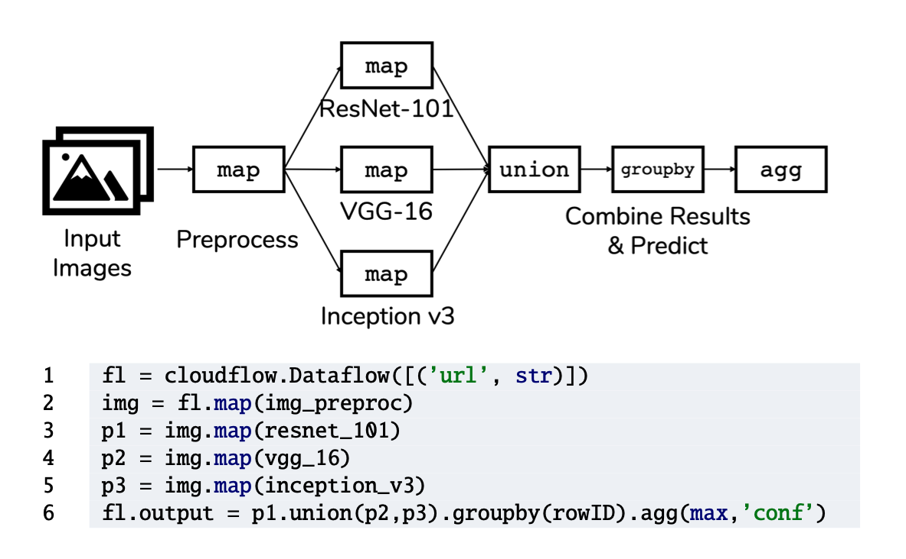
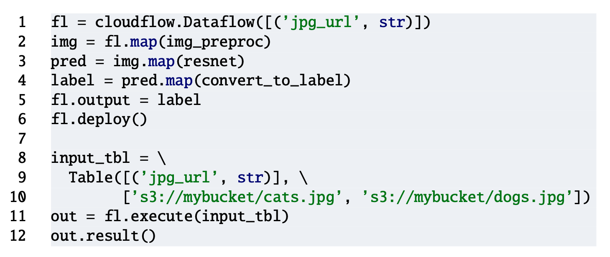
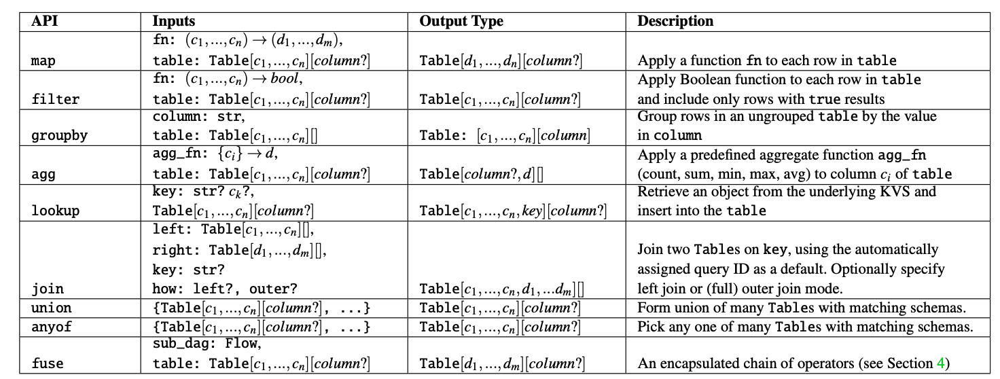
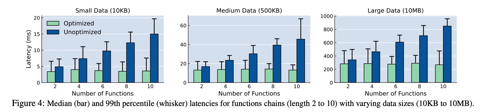
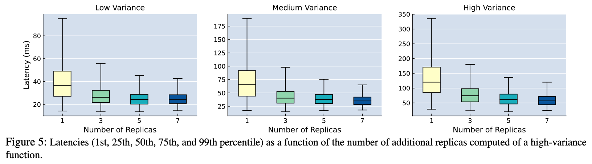
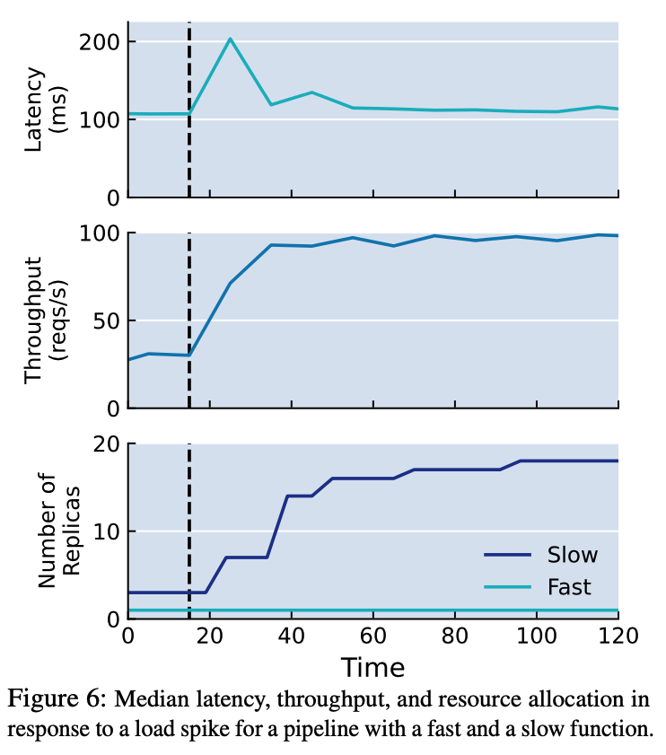
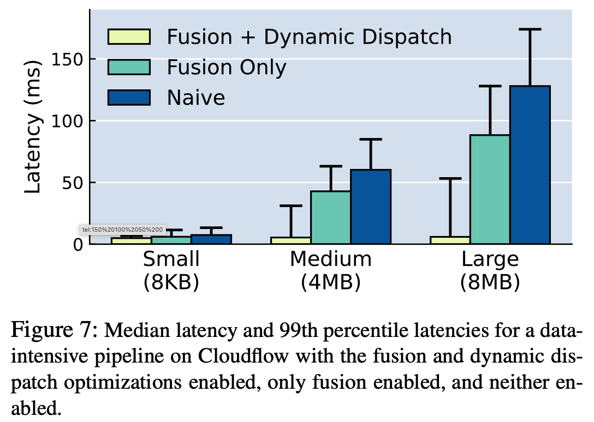
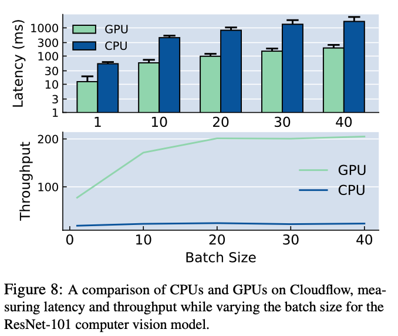
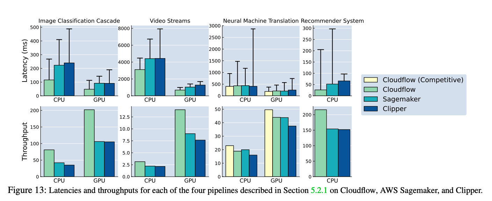

# Optimizing Prediction Serving on Low-Latency Serverless Dataflow

## Background & Motivation

预测服务（prediction serving）是一个有趣的任务，因为它既结合了机器学习中复杂的计算同时还有性能需求，更具体的，预测服务有三个关键属性：

* 计算密集；
* 它属于应用程序中交互的一部分，因此有低延迟需求；
* 它是组合的，意味着一个请求需要经过多个 stage。

下图展示了一个 prediction serving 的示例，标准化一个输入图像，并行执行三个图像分类模型，组合结果完成预测，这个 pipeline 通常被称作模型集成（model ensemble）。

这种 pipeline 很自然的就形成了 dataflow graph：每个 stage 获取一个输入，进行一定的数据转换，然后把结果传递给下游。实际上，上图的例子可以很容易的用传统的 map，filter 和 join 这种操作来组织。但是现有的系统和这种直观的做法却是相违背的：AWS Sagemaker 要求用户为每一个 stage 手动构造一个容器，Pretzel 让用户通过一套他们提供的 api 去重写一套模型逻辑以更好的利用它们的系统。这篇论文提出了一个 Cloudflow 的系统，它解决的问题就是通过提供了一套传统的 API 赋能用户去实现这种 pipeline 的优化而不需要去对原来的黑盒 ML 模型做任何的修改。为此，他们关注 dataflow 和 prediction serving 相关的五点优化：

* **Operator Fusion**：数据流中的各个阶段可能会传递重要数据，例如视频或图像。为了最大程度地减少通信，融合这些 operator 以避免数据移动是有益的；
* **Competitive Execution**：机器学习模型的执行时间会高度变化，具体取决于模型结构和输入复杂度，与 MapReduce 的落后者类似，Competitive Execution 可以有效改善 ML 模型的 tail latency；
* **Operator Autoscaling and Placement**：鉴于 pipeline 中的计算任务的多样性（比如简单的关系运算和复杂的神经网络推理），我们自然希望更多的资源用于瓶颈任务；
* **Data Locality**：尽管任务通常是计算密集型，但是通常涉及大量数据访问，数据局部性因此很重要；
* **Batching**：像神经网络这样的模型可以从在 GPU 上的批量执行中受益匪浅，从而以更高的延迟成本提高了吞吐量。 吞吐量的提高转化为更好的资源利用率，从而降低了成本。

此外，Cloudflow 是基于 FaaS 部署的，使用的系统是自家的 Cloudburst。

## Architecture & API

这一节主要介绍 Cloudflow API，以及它们是怎样编译到 Cloudburst Serverless 平台上的。

Cloudflow API 有三个核心概念：一个表示数据的 **`Table`** 类型，一个用来将 `Table` 进行计算的 **`Operator`**；一个 **`Dataflow`** 用来表示 `Operator` 的 DAG 图。一个 Python 程序只要定义了 `Dataflow` 然后在一个 `Table` 上执行，Clouflow runtime 就会调用 `Operator` 然后生成一个输出的 `Table`。

每个 Table 有一个 **`schema`**，它就是一个列描述符的 list，每个描述符由 `name:data-type`组成。实际上你可以把 Table 想象成一个 csv 表。

下图是一个创建 Dataflow 的示例：

* 第 1 行：一个 Dataflow 根据用户输入的 schema 生成一个 Dataflow 实例；
* 第 2～4 行：Dataflow 接受一个单列的 table 作为输入，然后 pipeline 执行 map 操作；
* 第 5～6 行：Dataflow 获取结果，然后部署。一旦部署后，就可以通过调用 execute 不断执行，并通过 resault 获取结果。

执行期间，每一行数据都会有一个唯一的 ID，并在整个执行期间生效。

下表表述了 Cloudflow 支持的核心 Operator，每个接受一个 Table 并输出一个 Table，`[c1...cn]` 就是一个 schema，`?` 表示可选的，`column?` 代表一个 Table 是否分组，这里不再介绍。

map，filter，join 和 union 运算符是相当标准的。 groupby 接受一个未分组的 Table 并返回一个分组 Table。  anyof 将其输入 Table之一传递给输出，输出的内容根据 runtime 决定。 fuse 用来在一个 Table 上执行多个运算符，后续会介绍。

agg 支持基本聚合：计数，总和，平均值，最小值和最大值。 join接受两个输入 Table，通过用户指定的键将它们连接起来。

最后，lookup 允许 Dataflow 与输入 Table 外部的数据进行交互。具体来说，它允许 Cloudburst 中 Anna KVS  的读取。后文会介绍，Cloudflow 使用 lookup 运算符中的信息来利用 Cloudburst 的 locality-aware 调度。

## Optimizing Dataflows and Evaluation

本节主要介绍这种前面 5 种优化的具体实现，以及相关实验。

### Operator Fusion

运算符 fusion 是指将一系列 operator 封装到一个 operator 中，它被编译成一个 Cloudburst 函数，从而确保函数在单个物理位置上执行还不会有 data movement。

来看一下相关实验：

来看一下使用 fuse 的效果，在这个实验中，函数链从 2 个到 10 个，一个使用了 fuse 一个没有，可以看到当数据较小函数数量较少的时候，fuse 的影响不明显，但是随着 function 越来越多，数据量的增大，latency 的提升就会高很多，这主要是因为 data movement。

**通过避免数据序列化和函数执行者之间的数据移动的开销**，Cloudflow 中的 operator fusion 可将延迟减少多达 4 倍。

### Competitive Execution

Competitive Execution 用于减少 operator 的 tail latency，解决的办法就是并行执行此类 operator 的多个副本。Cloudflow 中简单的 Dataflow 重写：创建相关 operator 的冗余并行副本，并添加 `anyof` 来消耗结果。然后，运行时可以选择首先完成的副本。

为了评估 Competitive Execution 的效果，论文构造了一个 3 stage 的 pipeline，第一个和第三个 operator 就是一个简单的值的传递，第二个函数是一个 gamma 概率分布，它的方差大小和 k 与 θ 的值有关，论文设置 k 为 3，θ ∈ {1, 2, 4} 分别代表低中高方差，然后第二个函数根据这个 gamma 概率分布返回的结果 sleep 对应的时间，下图展示了实验结果：

可以看到，当方差比较大的时候，Competitive Execution 随着副本数的增加效果是愈发明显的。

### Operator Autoscaling and Placement

每个 Operator 可能都有不同的性能需求，包括内存消耗，计算要求等。这种异构性在 AI 预测服务中尤其明显。例如，图像处理流程可能在基于 GPU 的神经网络之前使用 CPU 密集型预处理阶段。

论文重在两个优化：每个 operator 的自动缩放决策，以及每个 operator 调度到 Cloudflow 筛选出的硬件上。比如，如果预处理阶段需要被序列化且缓慢，而神经网络阶段高效且支持的批处理，那么将预处理的 function 部署到更多 CPU 可用的节点上，而将神经网络的 function 部署到少量 GPU 可用的节点上就足够了。

在论文的实验中，论文设置两个 function，一个快，一个慢，就像刚刚举的例子那样，然后在某一个时间点引入 4 倍负载提升，测量延迟，吞吐和资源分配，下图展现了实验结果：

可以看到，为了满足负载的突然提高，slow function 的副本数增到了 16，而 fast function 因为能够 handle 负载的上升因此仍然保持一个副本。

### Data Locality via Dynamic Dispatch

通过动态调度进行 Data Locality。例如，推荐系统可以查看用户最近的点击历史记录，然后查询数据库中的一组候选产品，最后返回给用户一组推荐项目。理想情况下，我们希望避免通过网络获取数据，因为这会很快成为延迟瓶颈。

默认情况下，Cloudburst 执行 locality-aware 的调度，尝试在可能缓存任务数据依存关系的节点上调度计算。但是，这叫要求预先声明所有请求的数据依赖关系，这和许多预测 pipeline 的动态性质相冲突。还是刚刚的例子，候选产品集是由用户的近期操作决定的，因此Cloudburst 调度程序不会事先知道请求的依赖关系。为了实现动态调度，需要 Cloudflow 重写和 Cloudburst 修改。

论文实现了两次 Cloudflow 重写。首先，Cloudflow 将每个 lookup 运算符与其下游的运算符 fuse 在一起，保证将处理逻辑与查找逻辑放在同一位置。

其次，Cloudflow 重写 lookup 运算符，以使 Cloudburst 能够在缓存了相应数据的节点上动态调度运算符。为了支持这一点，将 lookup 的 column 参数转换为 Cloudburst 在运行时可以处理的 ref。然后，Cloudflow 编译器在 lookup 之前拆分数据流，并生成两个 Cloudburst DAG，并使用 `to-be-continued(d, ref)` 的注解标记第一个 DAG，其中 d 是指向第二个 DAG 的指针。

然后，论文修改了 Cloudburst runtime，以支持 `to-be-continued` 的注解。当在 Cloudburst 中执行 `to-be-continued` 的 DAG 时，运算结果包含已解析的 ref（即第一个 DAG 处理完后生成的 table 存在 anna 种的位置）和 DAG 的 ID d 一起发送给 Cloudburst 调度程序。根据 ref，调度程序可以将 DAG d 放置在已缓存 ref 的 kv 条目的节点上。

实验结果表示使用了 dynamic dispatch 大幅降低了延迟。

### Batching

使用批处理是最常见的优化方法，通过牺牲一定的延迟来换取 GPU 并行执行。Cloudflow 提供了一种标志来表示这个 dataflow 是否需要启用 batch，下面这个实验展现了批处理的好处：

当 batch size 为 1 的时候，GPU 的吞吐量大概是 CPU 的四倍

在 CPU 上，当 batch size 从 1 到 40，延迟增加 8 倍，吞吐量加了 20% 左右，标准 CPU 不支持并行执行；

在 GPU 上，可以看到从 batch size 从 1 到 10 的延迟增加了 4.5 倍，吞吐量增加了 2.2 倍。在 10 到 20 之间，延迟进一步增加了 70％，而吞吐量仅增加了 18％。Batch size 超过 20 时，GPU饱和。

### Prediction Serving Pipelines Benchmark

最后是一个同行比较：

## Summary

Cloudflow 整体上来说没有什么亮点，之所以介绍这篇文章主要是首先它的优化方法和实现具有普适性，很多我们都可以参考；另外一点是它的实验做的很完整，比较有价值。

