# Understanding Ephemeral Storage for Serverless Analytics

## Review: Why Need Ephemeral Storage

在一些传统的分析框架（例如 Spark，Hadoop）中，缓冲本地存储中的中间数据，并直接通过网络在 task 之间交换数据。相比之下，Serverless computing 要求 task 无状态来实现高弹性和可扩展性。换句话说，task 的本地文件系统和子进程仅限于 task 本身的生命周期。此外，Serverless 平台不公开对 task 的调度和放置控制，因此难以直接在 task 之间进行通信。于是，解决 task 间通信的法是将中间数据存储在**公共的远程存储服务**中，并将这种 task 之间临时数据的存储称为 Ephemeral Storage，**短暂存储**。

有多种存储选择可用于这种临时数据，当然不同选项都提供不同的成本，性能和可扩展性权衡。 像 Amazon S3（Simple Storage Service）这样的对象存储服务提供了按需使用的容量和带宽，虽然它主要用于长期数据存储，但也可用于短暂数据。 而像 Redis 和 Memcached 这样的内存键值对存储以 DRAM 的高成本来提供高性能。

关于临时存储关注三个核心问题：

1. What are the ephemeral I/O characteristics of serverless analytics applications? （Serverless 应用的临时 I/O 有什么特点？）
2. How do applications perform using existing systems (e.g., S3, Redis) for ephemeral I/O? （使用现有系统的效果如何？）
3. What storage media (DRAM, Flash, HDD) satisfies I/O requirements at the lowest cost? （什么存储介质能够以最低的成本满足 I/O 需求？）

## What are the ephemeral I/O characteristics of serverless analytics applications?

为了能够讲清楚这件事，论文研究了三种不同 serverless 应用程序（图中实线和虚线代表不同阶段的 lambda）：

第一种是分布式编译：

- 使用了一个名为 `gg` 的框架来自动合成软件构建系统的依赖树，并协调 lambda 调用以进行分布式编译；
- 每个 lambda 从短暂存储中获取其依赖关系，计算（即根据阶段编译，存档或链接），并写入输出文件；
- 编译阶段 lambda 读取源文件，通常最多10 个KB。 虽然 55％ 的文件只读取一次（由一个 lambda 读取），但其他文件读取数百次（并行读取多个 lambda），例如 `glibc` 库文件；
- Lambdas archive 或 link 读取对象的大小最多10个MB。 使用 `gg` 来编译具有 850MB 短暂数据的`cmake`。

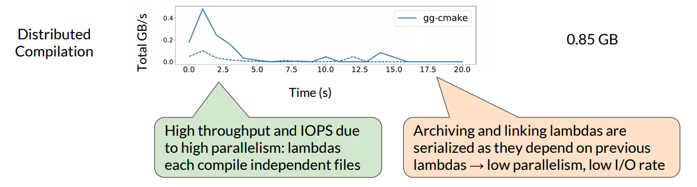

第二种是使用 MapReduce 排序：

- Mapping lambdas 从 S3 获取输入文件并将中间文件写入短暂存储。 Reduce lambdas 从 S3 读取中间数据进行排序，并将输出文件写入 S3；
- 排序是 I/O密集型的。 例如，当使用 500 lambda 排序 100 GB 时，吞吐量最多 7.5 GB/s。 每个中间文件只写入和读取一次，其大小与数据集大小成正比，与 worker 数量成反比。

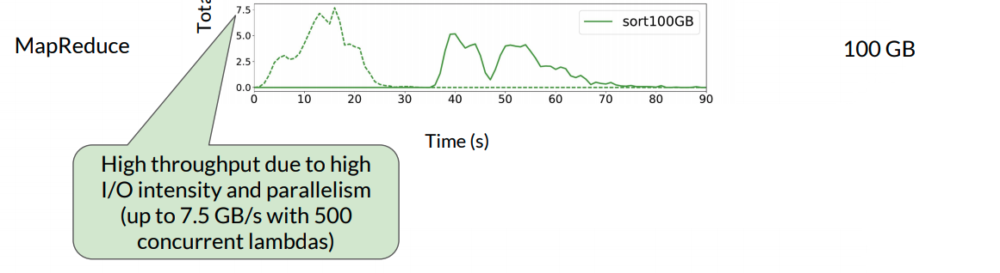

视频分析：

- 使用 Thousand Island Scanner（THIS）在 lambdas 上运行分布式视频处理；
- 输入是编码视频，分为批次并上传到存储。 第一阶段 lambdas 从短暂存储中读取一批编码视频帧并写回解码视频帧。 然后，每个 lambda 启动第二阶段 lambda，其从存储中读取一组解码帧，计算 MXNET 深度学习分类算法并输出分类结果。 总的存储容量为 6 GB。

下图展示了这三种应用程序 100 秒的时间里 I/O 的变化：

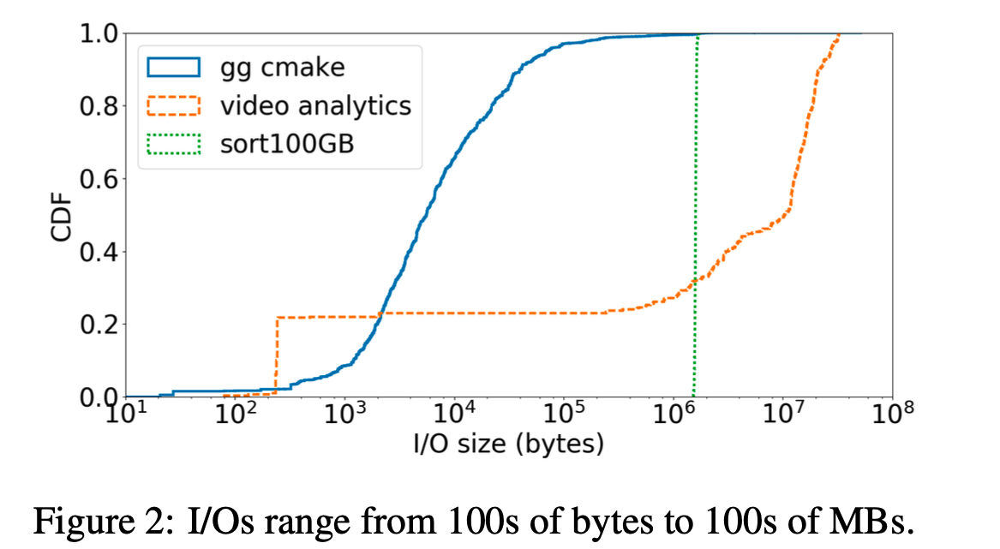

因此，一个**临时存储系统应该能够支持高吞吐量以及低延迟**。

## How do applications perform using existing systems for ephemeral I/O? 

为了搞清楚现有系统的表现情况，论文使用了三种不同类型的存储系统来分析应用程序性能：

- 基于磁盘的托管对象存储服务（Amazon S3）
- 基于内存的键值存储（ElastiCache Redis）
- 基于 Flash 的分布式存储系统（带有 ReFlex Flash 后端的 Apache Crail ）

下图显示了这三种存储系统的延迟：

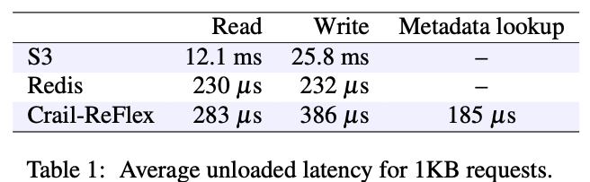

### Latency Sensitivity

对延迟敏感的任务来说，三种应用程序中，只有 `gg` 显示对存储延迟的一些敏感性，因为访问的大多数文件都低于 100 KB。下图展现了实验结果，在任务相同并发数相同的前提下，runtime 越高，意味着延迟越高。实验结果表明， 与 S3 相比，Redis 存储的延迟更低，最多可达 100 个并发 lambda。但是随着增加并发性，S3 和 Redis 会收敛，因为作业最终会受到 AWS Lambda 的计算限制。

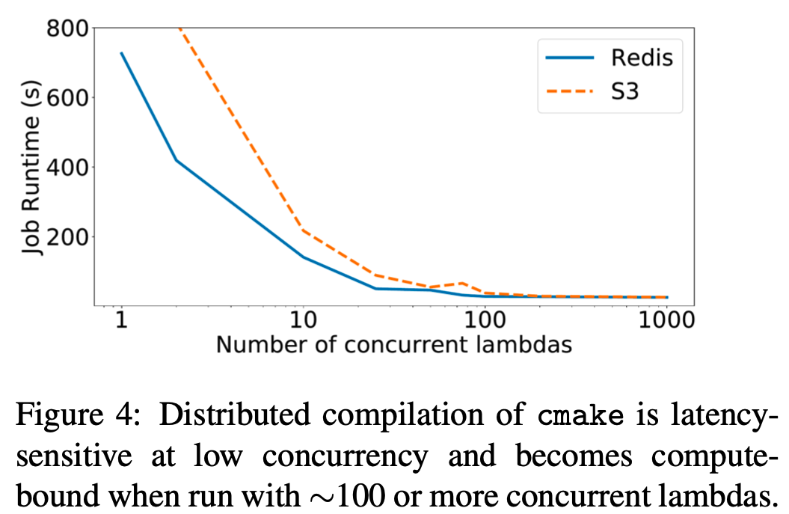

### The impact of application parallelism

虽然 serverless 平台允许用户通过启动许多并发 lambda 来利用高应用程序并行性，但是有些作业天然就带有并发数的限制（例如，由于 lambda 之间的依赖性），因此这些作业可能遇到的是 lambda 资源瓶颈（例如，内存，计算，网络带宽）而不是存储瓶颈。还是以 `gg cmake` 作为例子，构建过程的第一阶段具有高并行性，因为每个文件都可以独立地进行预处理，编译和组装。但是，后续 archive 和 link 文件的 lambda 取决于早期阶段的输出。

下图展示了并发度最高为 650 的 lambda 执行作业时的表现，横坐标表示已经执行的 lambda 数量（因此后续的 lambda 执行时间不断上升，因为后续的 lambda 需要等待前面的 lambda 执行完以后才能开始执行）：

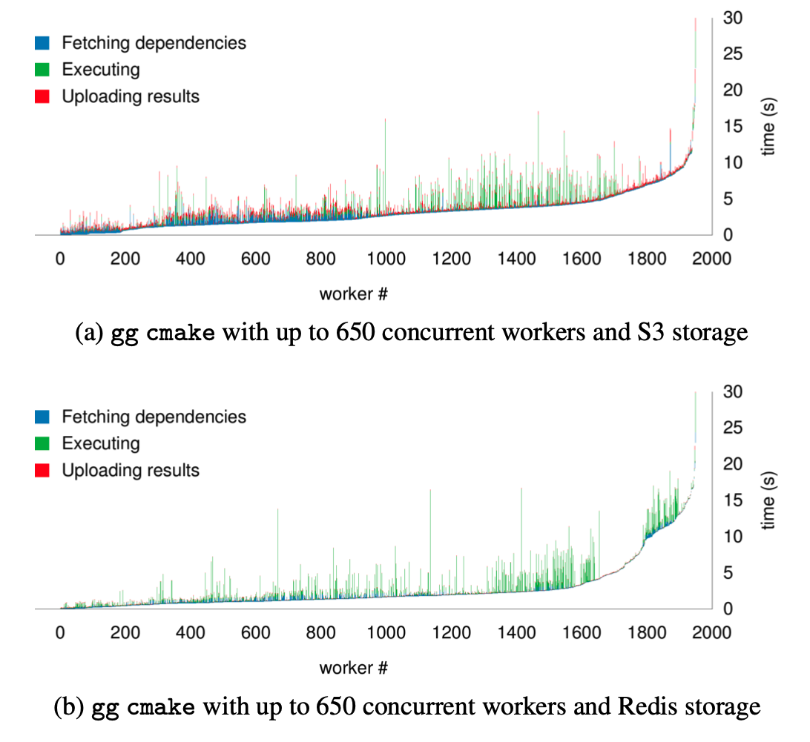

使用 Redis 和使用 S3 相比，能将 lambda 在 I/O 上花费的平均时间从 51％ 减少到 11％。但是，无论存储系统如何，作业大约需要 30 秒才能完成。**这是因为瓶颈主要在于数据依赖**。

### High I/O intensity

I/O 密集型的应用程序，以 MapReduce 排序和视频分析作为实验对象，首先是 MapReduce Sorting，它对 I/O 的要求比较高：

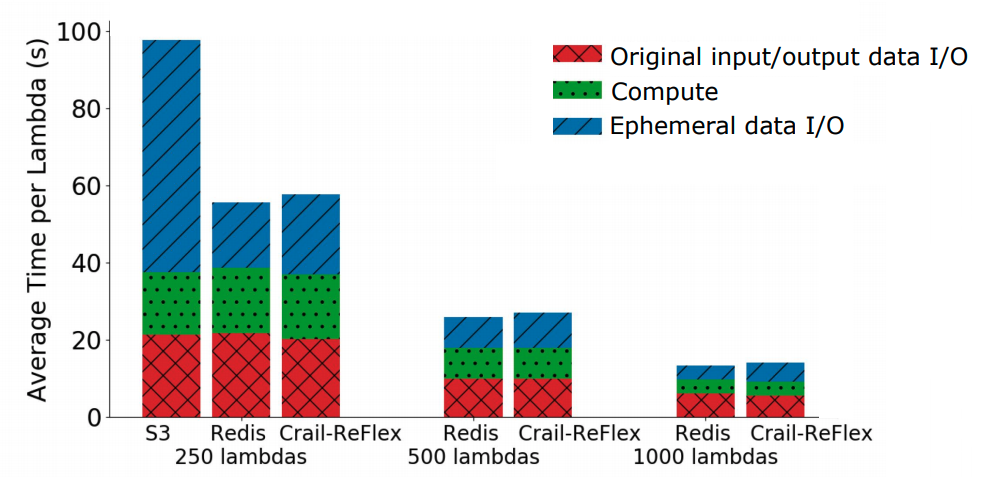

由图得到几个结论：

* S3 吞吐量一般，并发数为 500 和 1000 的时候没有 S3 是因为那个并发量下 S3 直接报错；
* 而 Flash 和 DRAM 的性能差不多。

然后是对 CPU 和 I/O 要求都高的视频分析：

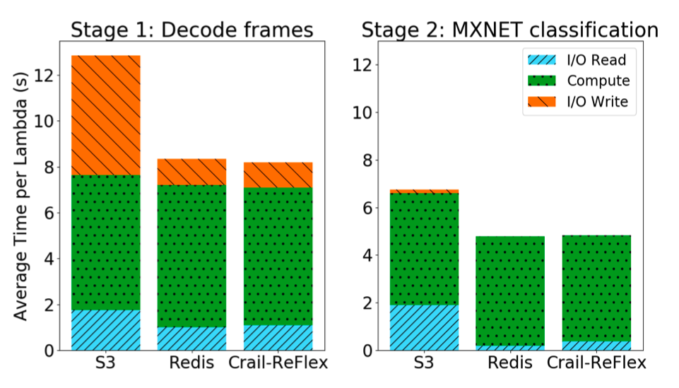

可以得到和 MapReduce 类似的结论。

### What storage media satisfies I/O requirements at the lowest cost?

最后论文分析了不同的应用程序应该选哪种类型的介质存储，它通过一个比例模型 `Throughout/Capacity` 来计算 DRAM，Flash 和 DISK 的比率，再将三种应用做同样的计算，然后进行比较：

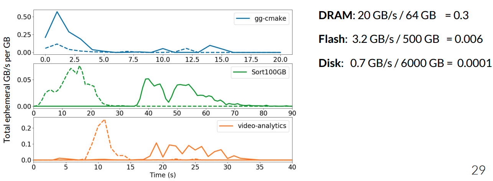

可以看到，排序应用程序适合用于基于 Flash 的短暂存储。 gg-cmake 和视频分析工作更适合 DRAM。

## Putting it All Together...

将之前的全部实验内容整合起来，可以得到以下结论：

* Ephemeral storage wishlist for serverless analytics:
  *  High throughput and IOPS;
  * Low latency, particularly important for small requests;
  * Fine-grain, elastic scaling to adapt to elastic application load;
  * Automatic rightsizing of resource allocations;
  * Low cost, pay-what-you-use;
* Existing systems provide some but not all of these properties.

## Summary

* Our analysis motivates the design of an ephemeral storage service that supports automatic, fine-grain storage capacity and throughput allocation
* Ephemeral I/O requirements depend on a job’s latency sensitivity, inherent parallelism and its I/O vs. compute intensity
* Flash is an appealing storage media for ephemeral I/O performance-cost requirements

# Pocket: Elastic Ephemeral Storage for Serverless Analytics

## Background

我们已经具体分析了期望的 serverless ephemeral 属性，现在具体分析一下：

* 首先，要**针对各种大小的 Object 都能提供高性能**：在之前的实验中已经看到，使用 500 lambda 排序 100 GB 需要高达 7.5GB/s 的吞吐量，而类似 `gg cmake` 则涉及大量的小 Object 的访问，因此低延迟很重要。总之，Ephemeral Storage 需要具备高吞吐量，低延迟；
* **低成本**：低成本代表需要提供细粒度的用户收费。Serverless 可能会并发启动数千个短期任务，负载又可能在短时间消散，Ephemeral Storage 必须能够针对这种情况 autoscaling，既满足需求又能够降低成本。另外，在前面的实验中已经看到，不同类型的应用适用不同的存储媒介，因此为不同的应用选择一个合适的存储媒介也是重要的，同样能够提高性能和降低成本；
* **~~容错~~**：最后，考虑一下容错在 Ephemeral Storage System 中的必要性，短暂数据仅在作业执行期间有价值，并且可以轻松地重新生成。*因此，它不必像传统存储系统那样提供高容错性*。

这篇论文提出了 Pocket，具有以下几个特点：

* 一个弹性的分布式数据存储，用于短暂数据共享；
* Pocket 通过以下方式实现高性能和高成本效益：
  * 利用多种存储技术；
  * 对应用程序的资源分配进行适当调整（如何分配，存储媒介是什么）；
  * 根据使用情况自动缩放集群中的存储资源。

论文表明使用 Pocket 可以达到和 Redis 相当的性能并且能够节省大约 60% 的成本。

## Pocket Architecture

Pocket 的设计如下图：

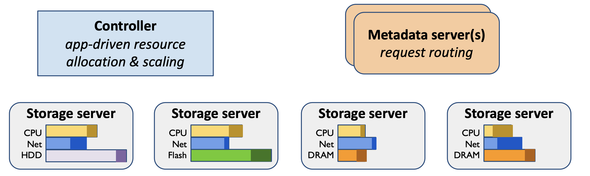

Pocket 由一个 Controller，一个或多个 Metadata Server 和多个数据平面 Storage Server 组成（彩色条显示集群中所有作业的已使用和已分配资源）。

Controller 为作业分配存储资源，并随着作业数量及其要求随时间变化动态扩展 Metadata Server 和 Storage Server。 Controller 还为作业做 Data placement 的决定。Metadata Server 通过将客户端请求引导到适当的 Storage Server 来进行数据放置。 

通过将它们分成三个切面的单位资源，Pocket 可以根据不同的 bottleneck 的情况进行 autoscaling。

### Using Pocket

下面来看一下如何使用 Pocket：

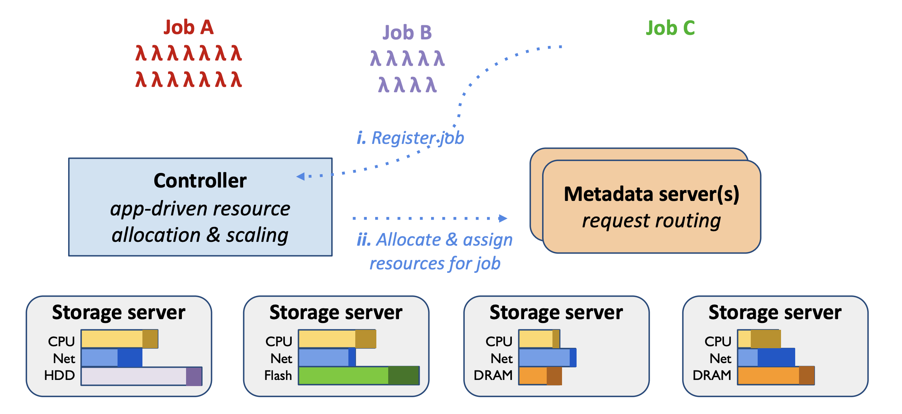

为了使用 Pocket，一个 Job 首先要注册一个 job，Controller 会为这个 Job 分配相应的资源，这一部分分配的逻辑会在后文介绍。Controller 会将这个信息（包括 Storage Server 的 ip 地址， 存储的放置策略，）告诉给 Metadata Server，后续 Metadata Server 负责引导客户端进行数据存储。

注册完成后，Job 将启动 lambda：

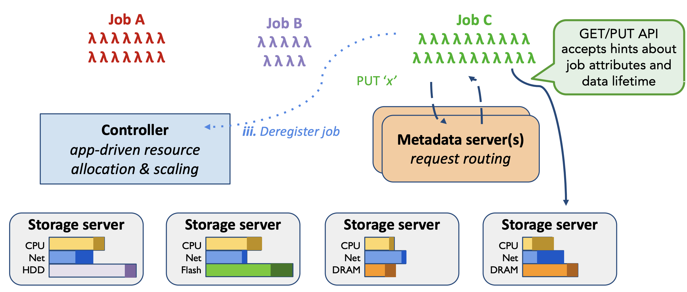

Lambda 首先连接到其分配的 Metadata Server，这个 IP 地址由 job 注册时的 Controller 提供的。 Lambda 客户端通过联系  Metadata Server 获得 Storage Server 的 IP 地址和块地址来写入数据。 

默认情况下，当 Job 完成后，Job 会向 Controller 发起一个取消注册的信息，Controller 就会释放 Pocket 资源。

### Assigning Resources to Jobs

前文介绍了，Controller 注册 Job 的时候，会为这个 Job 分配相应的资源，一个重要的内容是如何适当的预估分配多少资源。Register Job 的时候有一个可选的参数 hint，它标记了关于这个 Job 的一些特点，比如是否延迟敏感，最大任务并发数，中间数据容量的需求，以及带宽需求。Controller 就会根据这些 hint 决定关于吞吐量的分配，容量的分配以及存储介质的选择：

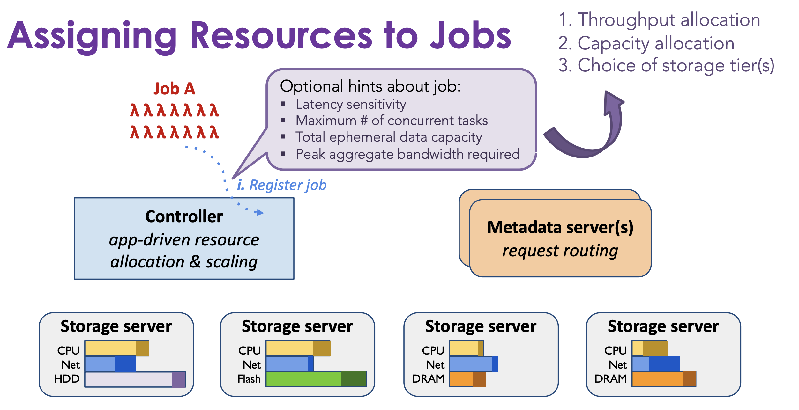

一个关于这部分分配策略详细的内容如下表：

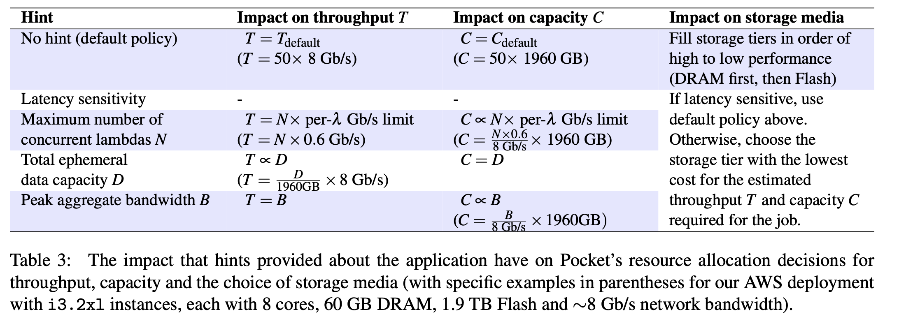

Controller 再根据得到的放置策略决策，根据 online bin-packing 算法确定一个具体的 Job Weight Map，它是一个数据存储分配表（0～1），用来表示放在该 storage server 上的数据集的比例。如果 storage server 分配了 1 的权重，它将存储 job 的所有数据。

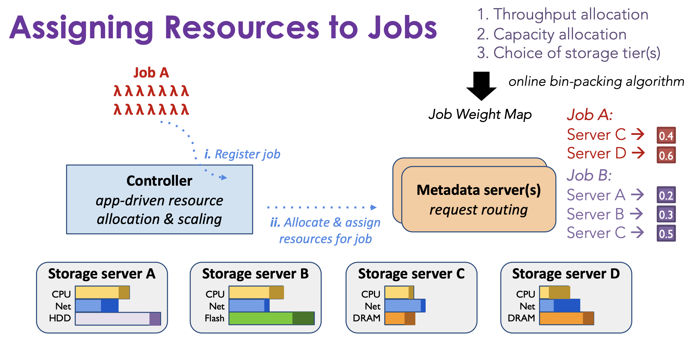

### Autoscaling the Pocket Cluster

Pocket 使用策略自动扩展群集，该策略旨在维护目标范围内每种资源类型（CPU，网络带宽和每个存储层的容量）的总体利用率。可以为每种资源类型单独配置目标利用率范围，并为 Metadata Server，Storage Server 单独管理。

由于短暂的数据对象只能存活数十到数百秒，因此在添加或删除节点时迁移此数据以重新分配负载会产生很高的开销。 相反，Pocket 专注于在加入集群的处于活跃状态下的新存储服务器上进行的数据转向。 Pocket 通过为每个 Job Weight Map 分配特定权重来控制数据转向。 为了平衡负载，Controller 会为未充分利用的 Storage Server 分配更高的权重。

## Evaluation

参数如下图：

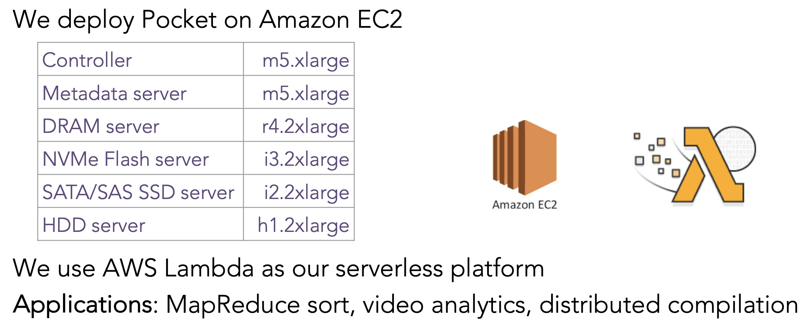

对于 MapReduce 作业而言，可以看到性能基本和 Redis 一致：

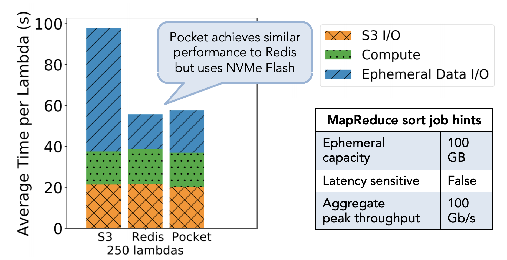

而在成本方面，Pocket 节约达 60%：

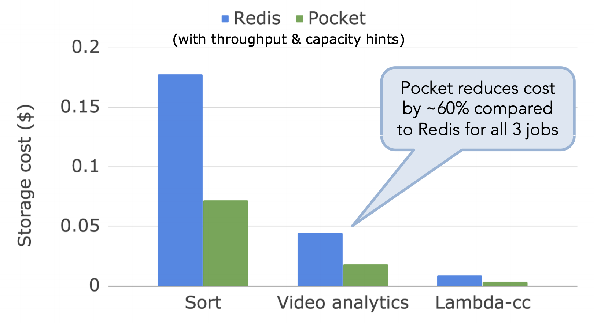

最后，Pocket 在 autoscaling 方面证明了有较好的表现：

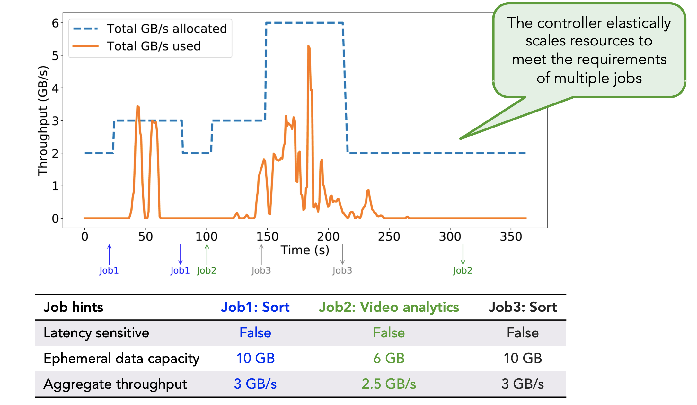

## Conclusion

Pocket is a distributed ephemeral storage system that:

* Leverages multiple storage technologies
* Rightsizes resource allocations for applications
* Autoscales storage cluster resources based on usage